# AWS Architecture & CI/CD Pipeline Plan

This document outlines the architecture for deploying the MEAN stack application to an AWS EC2 instance using Docker Compose, with a CI/CD pipeline powered by GitHub Actions.

## Architecture Overview

## Architecture Overview

```mermaid
graph TD
    User["User"] -->|HTTP Port 80| IGW["🌐 Internet Gateway"]

    subgraph AWS_Cloud ["☁️ AWS Cloud"]
        subgraph VPC ["🟧 VPC (Custom VPC)"]
            subgraph Public_Subnet ["🟦 Public Subnet"]

                IGW -->|Route| SG["🛡️ Security Group"]
                SG -->|Allow Port 80/22| EC2["💻 EC2 Instance"]

                subgraph Docker_Host ["🐳 Docker Host"]
                    Nginx["🔁 Nginx Proxy"]
                    Frontend["📦 Frontend Container"]
                    Backend["📦 Backend Container"]
                    Mongo["🍃 MongoDB Container"]
                end

            end
        end
    end

```

## Components

### 1. Infrastructure (AWS)
-   **Network (VPC)**:
    -   **Custom VPC**: Isolated network environment.
    -   **Public Subnet**: Hosts the EC2 instance, allowing public access via Internet Gateway.
    -   **Internet Gateway (IGW)**: Enables connectivity between the VPC and the internet.
    -   **Route Table**: Configured to route traffic from the subnet to the IGW.
-   **Compute**: Amazon EC2 (Ubuntu 22.04 LTS) placed within the Public Subnet.
-   **Security**:
    -   **Network ACLs**: Stateless traffic filtering at the subnet level.
    -   **Network**: Security Group allowing Inbound traffic on Port 80 (HTTP) and Port 22 (SSH).
-   **Storage**: EBS Volume for EC2 (Persistent data for MongoDB).

### 2. Containerization (Docker)
-   **Frontend**: Angular app served by Nginx (Internal Port 80).
-   **Backend**: Node.js/Express app (Internal Port 80).
-   **Database**: MongoDB official image (Internal Port 27017).
-   **Orchestration**: Docker Compose to manage the multi-container application.

### 3. CI/CD Pipeline (GitHub Actions)
The pipeline consists of three main jobs:

#### Job 1: Lint & Test
1.  **Checkout Code**: Pull the latest code.
2.  **Linting**: Run code quality checks (ESLint, etc.).
3.  **Unit Tests**: Run unit tests (if available).

#### Job 2: Build, Scan & Push
1.  **Build Images**: Build `frontend` and `backend` Docker images.
2.  **Security Scan**: Use **Trivy** to scan the built images for vulnerabilities.
    -   If critical vulnerabilities are found, the pipeline fails.
3.  **Login to Docker Hub**: Authenticate using GitHub Secrets.
4.  **Push Images**: Push the safe images to Docker Hub.

#### Job 3: Deploy to EC2
1.  **Authorize Runner IP**: Dynamically adds the GitHub Runner's IP to the Security Group (Port 22).
2.  **SSH into EC2**: Connect to the instance using GitHub Secrets.
3.  **Pull Latest Images**: Run `docker-compose pull`.
4.  **Restart Containers**: Run `docker-compose up -d`.
5.  **Verify Deployment**: Runs automated smoke tests (curl) to ensure services are up.
6.  **Prune**: Clean up old images.
7.  **Revoke Runner IP**: Removes the Runner's IP from the Security Group (always runs).

## Implementation Steps

### Step 1: Docker Hub Setup
1.  Create a Docker Hub account.
2.  Create two repositories: `your-username/mean-frontend` and `your-username/mean-backend`.
3.  **Security**: Generate a **Docker Access Token** (Account Settings -> Security) to use instead of your password.

### Step 2: AWS EC2 Setup
1.  Launch an Ubuntu EC2 instance.
2.  Install Docker and Docker Compose on the instance.
3.  Allow Port 80 in the Security Group.

### Step 3: GitHub Secrets
Add the following secrets to your GitHub Repository:
-   `DOCKER_USERNAME`: Your Docker Hub username.
-   `DOCKER_PASSWORD`: **Use your Docker Access Token**.
-   `EC2_HOST`: Public IP of your EC2 instance.
-   `EC2_USER`: `ubuntu`
-   `EC2_SSH_KEY`: Your private SSH key content.

### Step 4: GitHub Actions Workflow
The workflow file is located at `.github/workflows/deploy.yml`. It handles the automated build, scan, and deployment process.
