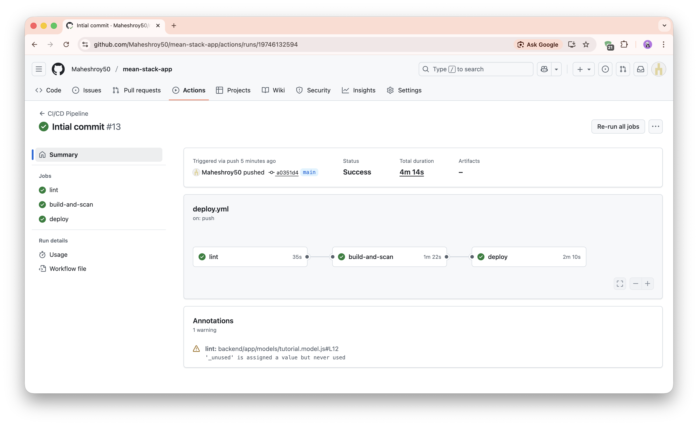
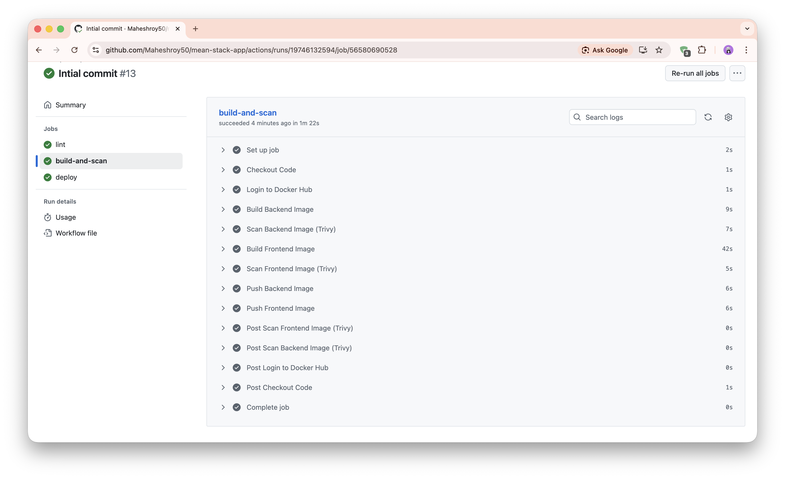
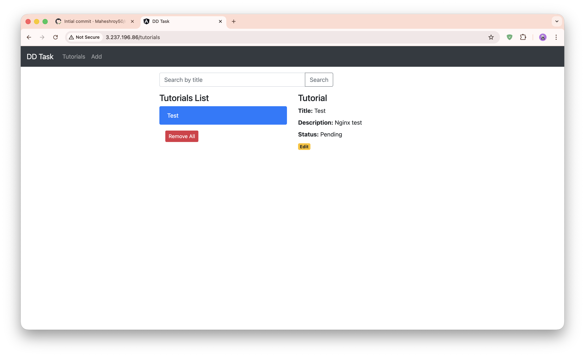
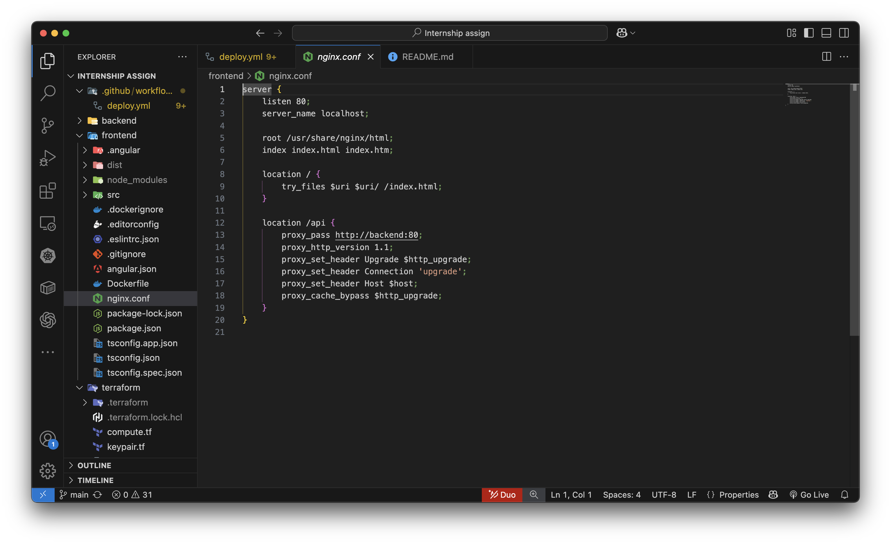

# MEAN Stack Dockerized Application

This is a full-stack CRUD application built with the **MEAN stack** (MongoDB, Express, Angular 15, Node.js). It has been fully **Dockerized**, optimized for production, and includes a complete **CI/CD pipeline** for deployment to AWS.

## 🚀 Features

-   **Full Stack**: Angular 15 Frontend + Node.js/Express Backend + MongoDB
-   **Dockerized**:
    -   Multi-stage builds for smaller images.
    -   Non-root user execution for security.
    -   Production-grade Nginx configuration.
    -   Docker Compose orchestration with healthchecks.
-   **CI/CD Pipeline**:
    -   Automated Linting (ESLint).
    -   Security Scanning (Trivy) for container vulnerabilities.
    -   Automated Build & Push to Docker Hub.
    -   Automated Deployment to AWS EC2.
-   **Code Quality**:
    -   Integrated ESLint for both Frontend and Backend.
    -   Standardized code style.

## 📋 Prerequisites

-   **Docker** and **Docker Compose** installed.
-   **Node.js** (v18+) (only for local non-Docker development).
-   **AWS Account** (for deployment).

## 🛠 Quick Start (Docker Compose)

The easiest way to run the application is using Docker Compose.

1.  **Clone the repository**:
    ```bash
    git clone <repository-url>
    cd <repository-folder>
    ```

2.  **Start the application**:
    ```bash
    docker-compose up -d --build
    ```
    *This will build the images, start MongoDB, Backend, and Frontend containers, and set up the network.*

3.  **Access the App**:
    -   **Frontend**: [http://localhost](http://localhost)
    -   **Backend API**: [http://localhost/api/tutorials](http://localhost/api/tutorials) (Proxied via Nginx)
    -   **Direct Backend**: [http://localhost:8080](http://localhost:8080) (Mapped to Internal Port 80)

4.  **Stop the application**:
    ```bash
    docker-compose down
    ```

## 💻 Development Setup (Manual)

If you want to run the services locally without Docker:

### Backend
1.  Navigate to `backend/`:
    ```bash
    cd backend
    npm install
    ```
2.  Start the server:
    ```bash
    node server.js
    ```
    *Runs on port 8080.*

### Frontend
1.  Navigate to `frontend/`:
    ```bash
    cd frontend
    npm install
    ```
2.  Start the Angular dev server:
    ```bash
    ng serve --port 8081
    ```
    *Runs on port 8081.*

## 🏗️ Infrastructure Provisioning (Terraform)

You can provision the entire AWS infrastructure (VPC, Security Groups, EC2) automatically using Terraform.

### Prerequisites
1.  **AWS CLI** installed and configured (`aws configure`).
2.  **Terraform** installed.
3.  **SSH Key Pair**: Create a key pair named `mean-stack-key` in your AWS Console (us-east-1) 

### Steps
1.  **Navigate to the directory**:
    ```bash
    cd terraform
    ```

2.  **Initialize Terraform**:
    ```bash
    terraform init
    ```

3.  **Preview Changes**:
    ```bash
    terraform plan
    ```

4.  **Apply Infrastructure**:
    ```bash
    terraform apply
    ```
    *Type `yes` when prompted.*

5.  **Access Your Instance**:
    After a successful apply, Terraform will output the **Public IP** and the **SSH command**.
    ```bash
    ssh -i mean-stack-key.pem ubuntu@<PUBLIC_IP>
    ```

## ☁️ Architecture & Deployment

For a detailed breakdown of the AWS Architecture (including **VPC**, **Public Subnets**, and **Security Groups**) and the CI/CD Pipeline, please refer to **[AWS_ARCHITECTURE.md](AWS_ARCHITECTURE.md)**.

### Infrastructure Highlights
-   **Custom VPC**: Production-grade network isolation.
-   **Public Subnet**: Securely hosts the application gateway.
-   **Security Groups**: Firewall rules allowing HTTP and SSH access from anywhere.

### CI/CD Pipeline Overview
The GitHub Actions workflow (`.github/workflows/deploy.yml`) performs the following:
1.  **Lint**: Checks code quality.
2.  **Build & Scan**: Builds Docker images and scans them for vulnerabilities using **Trivy**.
3.  **Push**: Pushes safe images to Docker Hub.
4.  **Deploy**: Connects to the AWS EC2 instance and updates the containers.

### Secrets Configuration
To use the pipeline, configure the following **GitHub Secrets**:
-   `DOCKER_USERNAME`: Your Docker Hub username.
-   `DOCKER_PASSWORD`: **Docker Access Token** (Recommended).
-   `EC2_HOST`: Public IP of your EC2 instance.
-   `EC2_USER`: `ubuntu`
-   `EC2_SSH_KEY`: Your private SSH key.

## 🔍 Linting & Code Quality

We use **ESLint** to maintain code quality.

-   **Run Backend Lint**:
    ```bash
    cd backend
    npm run lint
    ```
-   **Run Frontend Lint**:
    ```bash
    cd frontend
    npm run lint
    ```

## Screenshots

### CI/CD Configuration and Execution


### Docker Image Build and Push Process


### Application Deployment and Working UI


### Nginx Setup 

## 📂 Project Structure

```
.
├── AWS_ARCHITECTURE.md     # Architecture documentation
├── README.md              # Project documentation
├── docker-compose.yml     # Docker orchestration
├── backend/               # Node.js/Express Server
│   ├── Dockerfile         # Backend Docker image config
│   ├── .eslintrc.json     # Backend lint config
│   ├── server.js          # Entry point
│   └── ...
└── frontend/              # Angular Client
    ├── Dockerfile         # Frontend Docker image config
    ├── nginx.conf         # Nginx proxy config
    ├── .eslintrc.json     # Frontend lint config
    └── ...
```
